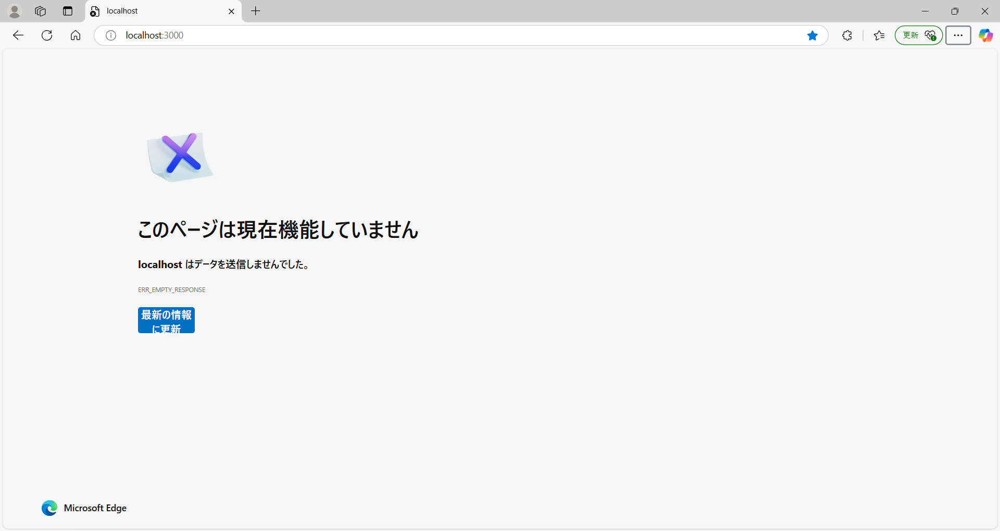
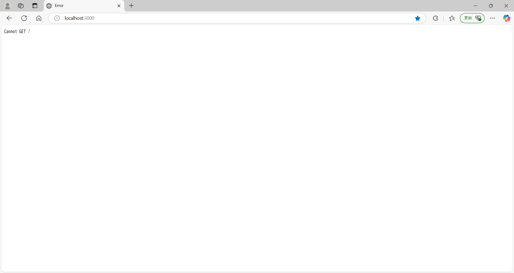
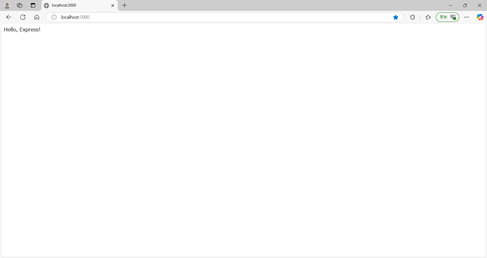
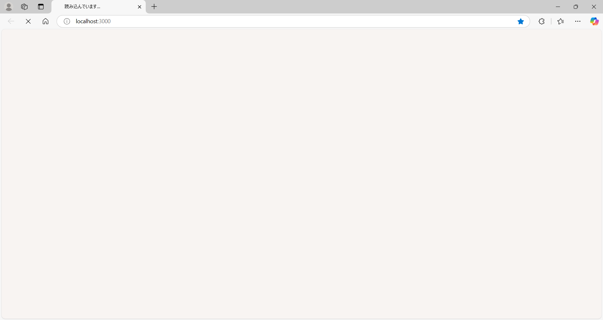

# Node.jsで作るWEBアプリケーション

## そもそもNode.jsとは
**`Node.js`** は、`JavaScript`でサーバーサイドのプログラムを記述するためのオープンソースランタイム環境です。<br>
`Node.js`が登場するまでは、`JavaScript`は主にWebブラウザ内で動作するスクリプト言語として使われていました。<br>
しかし、`Node.js`の登場により、サーバーやバックエンドのアプリケーションにも`JavaScript`が利用できるようになっています。<br>
さらに、`Node.js`とともに提供されている **`npm(Node Package Manager)`** というパッケージ管理ツールも非常に強力で、<br>
`npm`を利用することで、`Node.js`で開発を行う際に、必要なライブラリやツールを簡単に管理・インストールできます。<br>

今、使用している環境で`Node.js`と`npm`が使用できるかは、以下のコマンドを実行して確かめることができます。<br>

```bash
node --version
```
```bash
npm --version
```
上記のコマンドを実行して、それぞれでバージョン情報が正しく表示されていれば、`Node.js`と`npm`を使う準備は万全です。<br>

それでは、早速、実際に手を動かしながら、`Node.js`でWEBサービスを作る最初の一歩を始めてみましょう。<br>

---

## Node.jsにおけるプロジェクトの作成

今回作成するWEBサービスでは、1つのディレクトリにソースコードやその他のリソースを配置していきます。<br>
プロジェクトのディレクトリを作成し、ターミナルを開き、`cd`コマンド等でディレクトリに移動しましょう。<br>

まず、実行しなくてはいけないのは **プロジェクトの初期化(`initialization`)** の役割を持つ以下のコマンドです。<br>

```bash
npm init -y
```

このコマンドを実行すると、プロジェクトディレクトリ内に **`package.json`** ファイルが作成されます。<br>
この`package.json`は、`JSON`という形式で記述されている`Node.js`プロジェクトの中心となる設定ファイルです。<br>

ちなみに、実行コマンドの`-y`はデフォルトの設定を使用するときに使うものです。<br>
※ここでの`y`は、対話型プロンプトで提示される設定項目に関する全ての質問に対して、`yes`で進めるという意味です。<br>

---

## Expressのインストール

ここまでの作業で`Node.js`プロジェクトの設定ファイルである`package.json`を作成することができました。<br>
次は、プロジェクトで使用するパッケージをインストールしていきます。最初にインストールするのは **`Express`** です。<br>
`Express`は`Node.js`上で動作する軽量で柔軟な **Webアプリケーションフレームワーク** です。<br>

次のコマンドを実行してみてください。<br>

```bash
npm install express
```
では、このコマンドで進められる処理を順番に解説していきます。<br>

1. パッケージのデータを取得<br>
まず、`npm`は、`npm registry`（npmの公開レポジトリ）から`Express`パッケージのデータを取得します。<br>
そのとき、`npm`は`Express`の **依存関係** （`Express`を動作させるために必要な他のパッケージ）も含めてダウンロードします。<br>
便利なことに、`npm install`は、一つのコマンドで再帰的に依存関係を解決して必要な情報の全てを取得できるのです。<br>
※もしこの機能がなければ、パッケージをインストールするときに、他にインストールが必要なものを調べて、一つずつインストールすることになります。<br>

2. `node_modules`への保存<br>
次に、取得した`Express`を動作させるために必要なファイルをプロジェクトの **`node_modules`** ディレクトリに保存します。<br>
実際に、コマンドを実行する前にはなかった`node_modules`ディレクトリがみなさんの環境にも作成されているのではないでしょうか？<br>
`npm registry`から取得したデータは、ローカルの`node_modules`ディレクトリに保存されることで、プロジェクト内で自由に利用できるようになります。<br>
※この`node_modules`ディレクトリは、通常、`git`のバージョン管理には含めません。<br>

3. `package-lock.json`の生成（更新）<br>
さらに、このコマンドを実行すると、ローカルのプロジェクトディレクトリに **`package-lock.json`** というファイルも作成（更新）されます。<br>
`package-lock.json`には、パッケージの正確なバージョン情報や依存関係が記録され、インストールの再現性を保証する役割を持ちます。<br>

4. `package.json`の`dependencies`（依存関係）の更新<br>
最後に、このコマンドの実行によって、プロジェクトの初期化で作成された **`package.json`** も更新されます。<br>
`package.json`を開くと、`JSON`ファイルの **`dependencies`** の項目に`express`が追加されていることが確認できると思います。<br>

ちなみに、`package.json`は`package-lock.json`を人が読むのに適したフォーマットにした概要項目のようなものと捉えるといいかと思います。<br>

---

## サーバーの起動

※ここからは、WEBブラウザを使用していきますが、`Docker`で環境構築した場合でも、ポートフォワーディングをしていれば、ホスト端末のブラウザから操作できます。<br>

まずは、サーバーを立ち上げる前に、WEBブラウザを開いて、[`http://localhost:3000`](http://localhost:3000)にアクセスしてみましょう。以下のような画面が確認できるはずです。<br>
当然、まだサーバーを立ち上げていないので、アクセスしても「このページは現在機能していません」などの画面が表示されるだけです。<br>



では、プロジェクトディレクトリに`src`（ソースコード用配置用のディレクトリ）というディレクトリを作成して、`server.js`というファイルを作成しましょう。<br>
そして、作成した`src/server.js`に以下のような`JavaScript`のコードを記述していってください（コードの詳しい説明は後ほど行います）。<br>

```JavaScript
const express = require('express');

const app = express();

app.listen(3000);
```
続いて、この`src/server.js`ファイルを実行したいと思います。`Node.js`環境では、 **「`node`＋ファイル名」** で`JavaScript`を実行することができます。<br>
ターミナルから次のコマンドを実行してみてください。<br>

```bash
node src/server.js
```
プロンプトのカーソルが実行したコマンドの次の行の先頭で停止している状態であれば、実行が成功しているはずです。<br>

それでは、先程と同様にWEBブラウザを開いて、[`http://localhost:3000`](http://localhost:3000)にアクセスしてみましょう。<br>
以下のような先程とは異なる画面が表示されていませんか？<br>



一見、このWEBブラウザに表示された画面だけでは、サーバーが起動しているようには見えないかもしれません（確かにこの表示はエラーの表示ではあります）。<br>
しかし、この表示は、`localhost`というサーバーは、ポート番号3000番でクライアントからのアクセスを待ち受けてはいるものの、<br>
サーバー側でパス（エンドポイント）に対する応答を設定していないため、適切なレスポンスが生成されていないことを示す画面なのです。<br>

実は、サーバー内では、クライアントからのリクエストは全て特定のパス（例：`/user`や`/login`など）に対して処理されます。<br>
先程、アクセスした[`http://localhost:3000`](http://localhost:3000)では、特定のパスが指定されていないため、最上位の階層のパスである「`/`」が使用されることとなります。<br>
この「`/`」のパスに相当する処理をプログラムで記述していなかったため、`Cannot GET /`の画面が表示されることとなったのです。<br>

ともかく、`src/server.js`を実行することで、サーバーを起動させることができることは確認できたので、サーバーを終了させようと思います。<br>
サーバーを終了させるには、`node src/server.js`のコマンドを実行したターミナルで`Ctrl` + `c`を押して、プロセスを停止させてください。<br>

## ルートハンドラの作成

前回の章では、サーバーの起動には成功しましたが、パスに対する処理をプログラムで記述していなかったため、エラー画面が出てしまいました。<br>
そこで、`src/server.js`にコードを追加して、「`/`」にアクセスしたクライアントに対して、`Hello, Express!`という文字列を返す処理を用意してみましょう。<br>
このような、特定のパスへのリクエストに対する処理の内容を記述する関数を`Express`では**ルートハンドラ**と呼びます。<br>
以下の通りに`src/server.js`を編集してみてください。上から3つ目のブロックが新たに加わったコードになります。<br>

```JavaScript
const express = require('express');

const app = express();

app.get('/',(req,res)=>{
    res.send('Hello, Express!');
});

app.listen(3000);
 ```

そして、前回と同様に、ターミナルから以下のコマンドを実行して、`src/server.js`を実行してみましょう。<br>

```bash
node src/server.js
```

WEBブラウザで[`http://localhost:3000`](http://localhost:3000)にアクセスすると次のような画面が表示されるのではないでしょうか！<br>



表示が確認できた場合は、サーバーを終了させましょう。これも前回と同じくターミナルで`Ctrl` + `c`を入力しましょう。<br>

## ここまでに登場したコードの解説

さて、WEBブラウザからのリクエストに対して、サーバーから適切なレスポンスを返すことが確認できたので、ここで、コードの意味を説明していきます。<br>
まずは今後もよく使用する特に重要な記述について、詳しく見ていきましょう。<br>


### `require`

`require`は、別ファイルやパッケージから変数や関数、オブジェクトをインポートできる記述です。<br>
`require`は、`Node.js`の標準モジュールや指定されたパスにあるファイル、さらには`node_modules`内に保存されているモジュールを参照してくれます。<br>
※ちなみにこのモジュールのインポート方法は`CommonJs`というモジュールシステムで、他にも`import`キーワードを利用する`ECMAScript Modules`という方式があります。<br>
以下の`JavaScript`のコードでは、様々なモジュールの読み込みを行っています。
```JavaScript
const fs = require('fs'); //標準モジュールからファイル操作用のfsモジュールをインポート
const myModule = require('./myFolder/myModule.js'); //相対パスでモジュールを指定してインポート
const Express = require('express'); //node_Modulesに保存されたパッケージからモジュールをインポート
```

### `app`

`app`インスタンスは、`Express`のアプリケーション全体を管理する中心的なオブジェクトです。<br>
ここでは、ユーザーからのリクエストURLのパスに応じて適切な処理を割り当てるルーティングやポート番号を指定したリクエスト受付などを担当します。<br>
今回のコードでは、`app`から2つのメソッドが呼び出されていますが、`app.get`がルートハンドラの登録、`app.listen`がリクエスト受付開始の処理を担当しています。<br>
ちなみに、`app.get`の`get`は`HTTP`通信のリクエストメソッドであるGETメソッドのことを表していて、他にもPOSTメソッドに対応する`app.post`も存在します。<br>

### `req`/`res`

`req`オブジェクトは、クライアントから送信されるリクエストの情報を保持しています。<br>
これには、リクエストされたURLやHTTPメソッド、送信されたデータがある場合はその情報などが含まれます。<br>
`res`オブジェクトは、サーバーからクライアントへのレスポンスを操作するために使用されます。<br>
HTTPステータスコードの情報を保持したり、レスポンスの返却を行うメソッドが定義されたりしています。<br>
これらのオブジェクトはアクセスごとに独立しているので、複数のクライアントからの同時リクエストを安全に処理できます。<br>

### その他のコードの説明

なお、ここまでに登場した全てのコードの意味については、以下の表にまとめておきますので、興味がある人は、さらに調べたりしてみてください。<br>


|コード                               |説明                               |
|-------------------------------------|----------------------------------|
|`const express = require('express');`|`npm install express`で取得した`Express`パッケージのモジュールを`require`で読み込み、定数`express`に関数として代入しています。 |
|`const app = express();`             |関数`express()`を呼び出すことで、定数`app`に新しく作成されたインスタンスを代入しています。|
|`app.listen(*/ 数値 /*);`             |引数で受けたポート番号でリクエストを待ち受ける状態にしています。|
|`app.get('/',*/ 関数 /*);`          |第1引数で受けたパス（ここでは「`/`」）への`GET`リクエストに対して、どのような処理を行うかを決定する関数を登録するメソッドです。|
|`(req,res)=>{ */ 処理 /* });`         |`req`(リクエストオブジェクト)や `res`(レスポンスオブジェクト)を引数に受けて処理を行う関数です。|
|`res.send(*/ 文字列 /*);`            |`res`オブジェクトのクライアントに文字列を送信するメソッドです。|
---

 ※ここでの`express`は関数ですが、メソッドを持つというオブジェクトのような振る舞いもします。<br>
 ※ルートハンドラを登録する`app.get`の第1引数のパスは完全一致で判定されます。<br>

## ミドルウェアの作成

ここまでで、リクエストに対するルートハンドラを登録して、実行する処理やクライアントに返却するレスポンスを記述してきました。<br>
しかし、`Express`では、クライアントからのリクエストを受けて、ルートハンドラがレスポンスを返すまでの間に **ミドルウェア** というものを登録することもできます。<br>
ここでは、**ミドルウェア**について、`src/server.js`へ実際のコードを記述しながら見ていきましょう。<br>
次のコードはルートハンドラの作成で使用したコードにミドルウェアの登録を加えたものです。上から3つ目の部分が今回加えたコードです。<br>
新たに加わったコードでは、`app.use`の第1引数で対象パスを指定し、第2引数では、行わせたい処理を記述した関数(ミドルウェア関数)を指定しています。<br>
今回、第2引数のミドルウェア関数では、コンソールにリクエストされたURLと時刻を表示させる処理を用意してみました。<br>
※`app.use`の第1引数で指定するパスは、ルートハンドラと異なり、前方一致で判定されるため、空文字にすると全てのパスが対象になります。<br>

```JavaScript
const express = require('express');

const app = express();

app.use('',(req,res)=>{
    const timeStamp = new Date().toLocaleString();
    console.log(timeStamp + ' : ' + req.url);
 });

app.get('/',(req,res)=>{
    res.send('Hello, Express!');
});

app.listen(3000);
```
それでは、サーバーを起動させ、WEBブラウザで[`http://localhost:3000`](http://localhost:3000)にアクセスしてみましょう。<br>
次に、[`http://localhost:3000/test`](http://localhost:3000/test)にもアクセスしてみましょう。この時、コンソールには以下のようなログが表示されていれば処理は成功です。<br>
```bash
yyyy/MM/dd hh:mm:ss : /
yyyy/MM/dd hh:mm:ss : /test
```
しかし、ここでWEBブラウザを確認すると、以下のような読み込み中の画面になってしまっています。<br>

そこで、コードを以下のように修正してみましょう。<br>

```JavaScript
const express = require('express');

const app = express();

app.use('',(req,res,next)=>{
    const timeStamp = new Date().toLocaleString();
    console.log(timeStamp + ' : ' + req.url);
    next();
 });

app.get('/',(req,res)=>{
    res.send('Hello, Express!');
});

app.listen(3000);
```
このコードでは`app.use`メソッドの第2引数として渡されているミドルウェア関数で、`req`と`res`に加えて新たな引数を受け取っています。<br>
このミドルウェア関数の第3引数は **`next`** と表記され、データ型は関数となっています。そのため、**next関数**と呼んだりします。<br>
この関数は、処理の中で呼び出すことで、現在のミドルウェア関数での処理を完了し、次のミドルウェアまたはルートハンドラに制御を渡すことができます。<br>
next関数を加える前のコードでは、ミドルウェアの中で`next`が呼び出されないため、ミドルウェアで処理が停止し、レスポンスが返されなかったのです。<br>

この修正によって、[`http://localhost:3000`](http://localhost:3000)へのアクセスで、コンソールのログとWEBブラウザへのレスポンスの両方が行われるようになりました。<br>
このように、`Express`では、`next`関数を活用することで、リクエストがルートハンドラに到達したり、レスポンスがクライアントに送信されたりする前に、<br>
ミドルウェアを使って様々な処理を行わせることができるのです。<br>

まとめると、`Express`では、`app`インスタンスを使用しながら以下の手順でWEBサービスを成立させています。<br>
1. `express()`で`app`インスタンスを生成する。
2. `app.use`を使い、リクエストやレスポンスを加工したり、特定の処理を行うミドルウェアを登録する。
3. `app.get`を用いて、クライアントからのリクエストに対する処理（ルートハンドラー）を登録する。
4. `app.listen`でポートを指定し、サーバーを起動してリクエストを待ち受ける。
5. クライアントからのリクエストが到達すると、登録したミドルウェアやルートハンドラで処理し、レスポンスを送信する。

---

## この後の学習

ここまで`Express`の基礎を学んできました。ここからは、この後にどのような学習を進めればいいかを示してみます。<br>

- `nodemon`パッケージを`--save-dev`オプション付きでインストールして、`package.json`の`scripts`に開発サーバー起動の`dev`スクリプトを設定する。
- `app.use(express.static('public'));`で静的コンテンツを提供するミドルウェアを登録し、`public`フォルダに静的コンテンツを配置する。
- ルーターオブジェクトを別のファイルで作成し、モジュールとして読み込ませて、ミドルウェアとして登録することで、アプリケーションに組み込む。
- `req.query`や`req.params`を利用して、クエリパラメータやパスパラメータによるクライアントからの送信データを取り出す。
- `app.use(express.urlencoded({ extended: true }));`を登録して、`POST`メソッドで送信されるフォームのデータを`req.body`から取り出せるようにする。
- `EJS`パッケージをインストールして、`app.set('view engine','ejs');`でアプリケーションのビューエンジンに設定して、`res.render`からレンダリングを行う。
- `mysql2`パッケージをインストールして、WEBサーバーとデータベース(`MySQL`)を連携させる。
- `dotenv`パッケージをインストールして、`.env`ファイルを利用した機密情報の環境変数としての取り込みを行う。
- `express-validator`パッケージをインストールして、バリデーションを実装する。
- フォーマッターとして`Prettier`、リンターとして`ESlint`をインストールする。
- `passport`パッケージをインストールして、認証・認可の機能を実装する。その際に、`bcrypt`パッケージをインストールしてパスワードにハッシュ化を施す。
- `jest`パッケージを`--save-dev`オプション付きでインストールして、ユニットテストを作成する。
